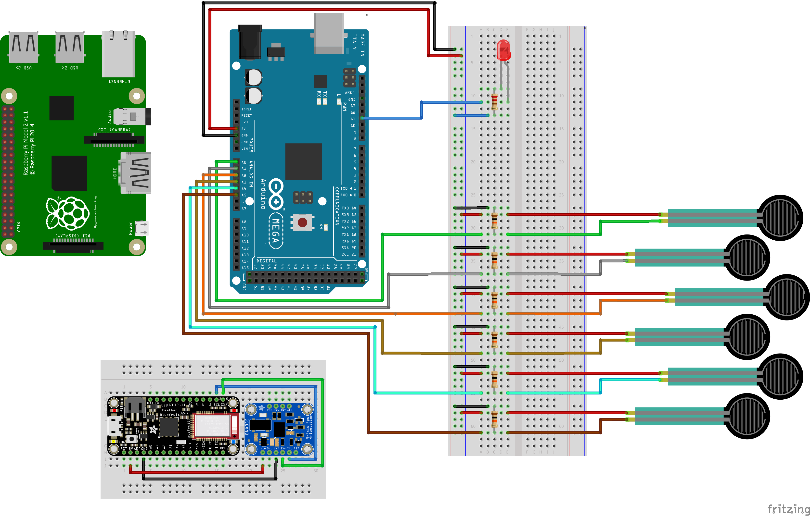

# Wheel.ID - *the chair that knows you*
        by William Hagen, Jelle Dott & Rosan Foppen

## Project Description
 We want to build a safety system that is designed for the wheelchair owner, by making a profile of him/her in order for the system to understand who is sitting/ using the wheelchair. This system works based on the weight, way of sitting and the way someone handles the wheelchair. If the wheelchair is used by the wrong person (not saved in the recognised profiles) an alarm will go off, together with some LEDs.

## Features

* Provides feedback on who is sitting in the chair by audio
* Shows (un)authorized usage by LED strips on the wheels
* Makes a user profile based on posture, weight and frequency of rotation of the wheels

# Sensors & Actuators

## Selection and motivation of the Sensors

- 6 Force sensing resistors
The force sensors will be placed in the seating of the wheelchair and, based on data, these will shape a profile of the main user. This profile can then be differentiated from other users, because the differences in weight and posture etc. vary.

- Accelerometer + gyro
The accelerometer is the second part of the two-step security system, it will measure the acceleration patterns of the main user. People might have very similar weight and postures, therefore this accelerometer will measure usage of the product, and act as a second security feature.

## Selection and motivation of the Actuators

Whenever a person with the incorrect profile uses the wheelchair, the security system will let the surrounding area/people + the main user know that something is wrong. The faulty usage will be made clear on the phone of the user (it’s connected) but also through different actuators on the wheelchair itself, namely:

# Installation

## Setup steps

Download our folder from github: wheelchair-design-platform/wheelchair:

 1. Connect Arduino to laptop
 2. Upload FSR_read.ino file to the Arduino Mega.
 3. Install dependencies (using dependencies.pdf) to set up the communication
 4. Upload IMU_arduino_code.ino file to the Blue Feather.
 5. Connect Raspberry to laptop
 6. Connect Raspberry to network (using dependencies.pdf)

 7. Attach Arduino Mega to the wheelchair frame.
 8. Attach Blue Feather to the left wheelchair wheel.
 9. Attach small Power Bank to the left wheelchair wheel.
 10. Attach big Power Bank to the wheelchair frame.
 11. Attach Raspberry Pi to the wheelchair frame.
 12. Attach FSR’s to wheelchair mainframe (for correct wiring see wheel id  electronics.png)
 13. Attach IMU (BNO055) on small breadboard into the left wheelchair wheel (see wheel id electronics.png for wiring).

 Make sure it is attached to the central turning point to ensure steady data measurement.

 14. Connect the Arduino Mega and Raspberry Pi using USB B cable.
 15. Connect the Raspberry Pi and Powerbank using USB cable.
 16. Connect the Adafruit Feather and Powerbank using Micro USB cable.

 If all cabled correctly and all dependencies installed correctly:

 Test IMU.

 17. Connect to the Raspberry Pi via the network.
 18. Run IMU_Grafana.py.
 19. Open Grafana.
 20. Check data.

 Test FSR.

 21. Connect to the Raspberry Pi via the network.
 22. Run FSR_Grafana.py.
 23. Open Grafana.
 24. Check data.

 Test IMU and FSR combined.

 25. Connect to the Raspberry Pi via the network.
 26. Run IMU_FSR_Grafana.py.
 27. Open Grafana.
 28. Check data.

 If all these tests were completed it is time to train the algorithm (thus far only with FSR data).

 29. Connect to the Raspberry Pi via the network.
 30. Run 1_Collect_and_label.py.
 31. Run 2_Train_and_Test.py.
 32. Run 3_Predict_sound.py.

If all went correctly the wheelchair is now able to recognize who is in the wheelchair, and will give audio feedback accordingly.

# Components

The components and their connections, used in our wheelchair, are listed below.

Arduino Mega microcontroller
   Location: Below the wheelchair frame
Connected to:
   * Raspberry Pi (Physical, USB Serial connection)
   * 6 x FSR (Physical, wires)
   * (LEDstrip (Physical, wires) < couldn’t fix it in time)

Adafruit Feather Bluefruit microcontroller
   Location: On the left wheel
Connected to:
   * Raspberry Pi (Bluetooth connection, GATT)
   * BNO055 IMU Orientation Sensor (Physical, wires)
   * Small Powerbank (Physical, Micro USB)

Raspberry Pi microprocessor
   Location: Below the wheelchair frame
Connected to:
   * Arduino Mega (Physical, wires)
   * Big Powerbank (Physical, Micro USB)
   * Speaker (Physical, USB)
   * Server (WIFI connection, MQTT)
   * Adafruit Feather Bluefruit (Bluetooth connection, GATT)

FSRs 6x
   Location: 4x on the seating, 2x on the backrest (for positioning see poster)
Connected to:
   * Arduino Mega (Physical, wires)

(LEDstrip)
   Location: The armrests of the wheelchair
Connected to:
   * Arduino Mega (Physical, wires)

BNO055 IMU Orientation Sensor
   Location: On the left wheel
Connected to:
   * Adafruit Feather Bluefruit (Physical, wires)

Speaker actuator
   Location: Next to handles of the wheelchair
Connected to:
   * Raspberry Pi (Physical, USB)

Powerbank x2
   Location: Big one, below the wheelchair frame
   Location: Small one, in the left wheel
Connected to:
   * Raspberry Pi (Physical, USB)
   * Adafruit Feather Bluefruit (Physical, Micro USB)

USB CABLE
   Location: between Raspberry Pi and Powerbank

MICRO USB CABLE
   Location: between Adafruit Feather Bluefruit and Powerbank

USB B CABLE
   Location: between Raspberry Pi and Arduino Mega.

Male - Male Jumpwires

Female - Male Jumpwires

- Audio
When the correct user uses the wheelchair, the built-in speaker system will welcome him or her and, automatically, the wheelchair will adjust to the user’s preferred settings. When an unauthorized person sits down in the wheelchair, the same audio system will says so.

- Light
There is also a LED-strip that will shine bright red or green depending on the user.
